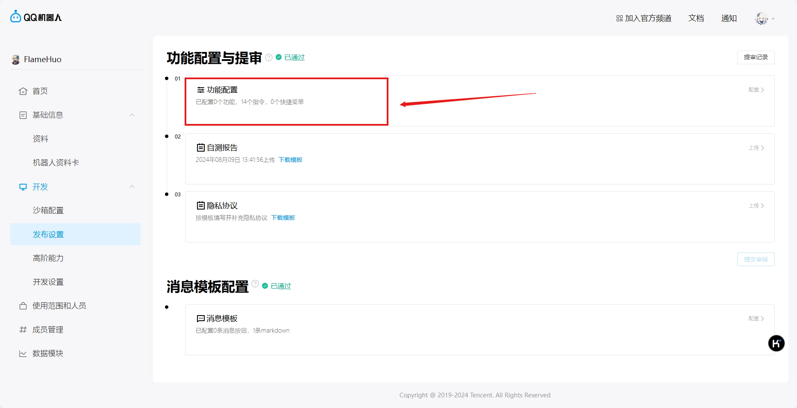
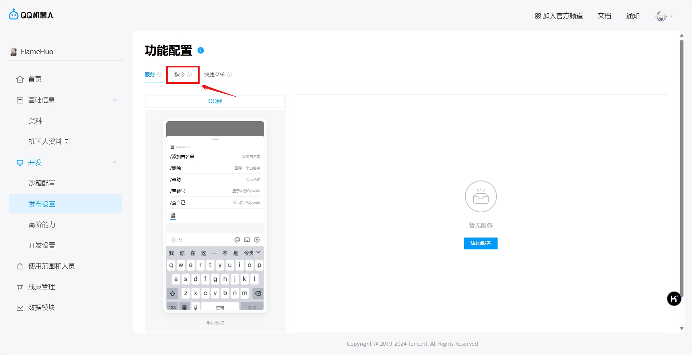
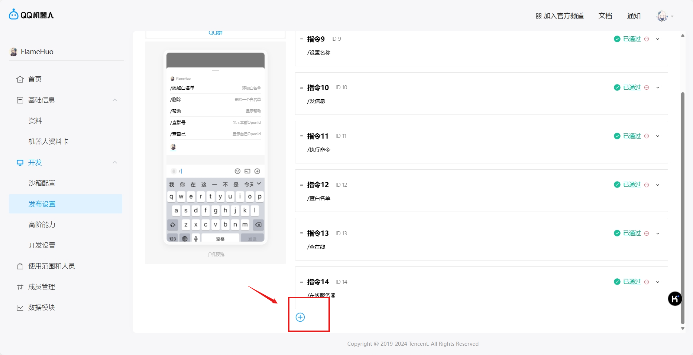
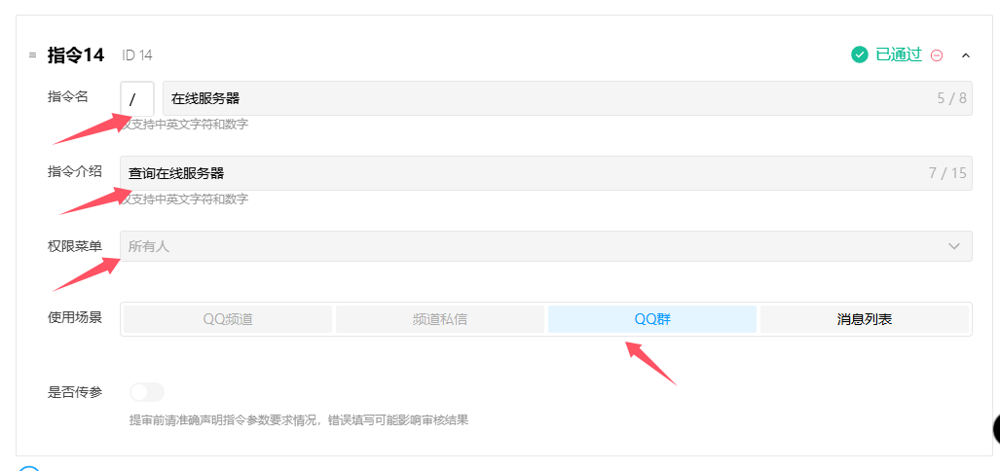
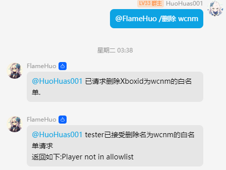
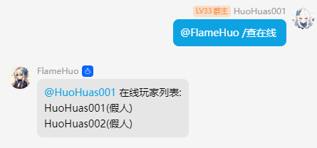

# FlameHuo Bot 框架
> 针对BDS服务器推出的QQ开放平台机器人框架
- 使用[QQ开放平台](https://q.qq.com)开发，无违反协议规定
- 使用Websocket协议对接

## 安装
1. 安装python 3.9+
2. 执行如下命令
```bash
pip install -r requirements.txt
```
3. 将`BDSAdapter`中的`FlameHuo.js`文件放入BDS/plugins文件夹内，创建文件夹完毕后，将剩余文件放入`FlameHuo`文件夹
4. 对`config.json`进行配置
    - sendGroupId和recvGroupId可在机器人正式上线后使用`/查本群`来查询
    - wsUrl在程序正常运行之后会输出
    - serverName可自行更改
    - addSimulatedPlayerTip对服内玩家列表中的模拟玩家加上`(假人)`的后缀

## 使用
1. 在[QQ开放平台](https://q.qq.com)中注册账号并创建机器人，具体参见[QQ开放平台文档](https://bot.q.qq.com/wiki/#_3-%E4%B8%AA%E4%BA%BA%E4%B8%BB%E4%BD%93%E5%85%A5%E9%A9%BB)
2. 使用如下命令运行程序
```bash
python index.py
```
3. 根据程序提示输入机器人在[QQ开放平台](https://q.qq.com)上的信息
4. 若要屏蔽群内信息，可使用`/flamehuo`来进行调整

## 开放平台机器人配置
如需完整体验开放平台，则需要按下列操作配置指令
1. 打开开放平台的`发布设置-功能配置`

2. 打开`指令配置面板`

3. 点击添加指令

4. 按模板配置指令(请参考下列`功能一览`)

- ⚠ `必须严格按照下列功能一览来填写指令，否则会审核不通过`⚠


## 附件（!!!下载后红字部分需修改!!!）
- [自测报告链接](Imgs/机器人自测报告模板-2023.xlsx)
- [隐私链接](Imgs/第三方机器人隐私保护指引.docx)


## 贡献
如果您有任何问题，请开启一个 issue 来讨论  
欢迎 PR

## 功能一览:
| 指令 | 权限 | 说明 |
| :----| :----: | :---- |
|/添加白名单 `{Xbox Id}`|**`管理员`**|向服务器内***添加***一个白名单|
|/删除 `{Xbox Id}`|**`管理员`**|向服务器内***删除***一个白名单|
|/帮助|`任何人`|显示此帮助|
|/查群号|`任何人`|显示本群OpenId|
|/查自己|`任何人`|显示自己OpenId|
|/加管理 `{groupId}` `{authorId}`|**`管理员`**|为本群***添加***一个机器人管理员|
|/查管理 `{groupId}` `{authorId}`|`任何人`|查询此人是否为本群机器人管理员|
|/删管理 `{groupId}` `{authorId}`|**`管理员`**|为本群***删除***一个机器人管理员|
|/设置名称 `{昵称}`|`任何人`|设置自己在本群群服互通的名称|
|/发信息 `{消息}`|`任何人`|群服互通向服务器内发送消息|
|/执行命令 `{命令}`|**`管理员`**|向服务器发送执行命令的请求|
|/查白名单 `{页码或关键词}`|**`管理员`**|查询服务器内置白名单|
|/查在线|`任何人`|查询服务器在线名单|
- 注:若XboxId有空格请打上双引号,如:"XboxId"

## 部分功能展示



# Todo List:
